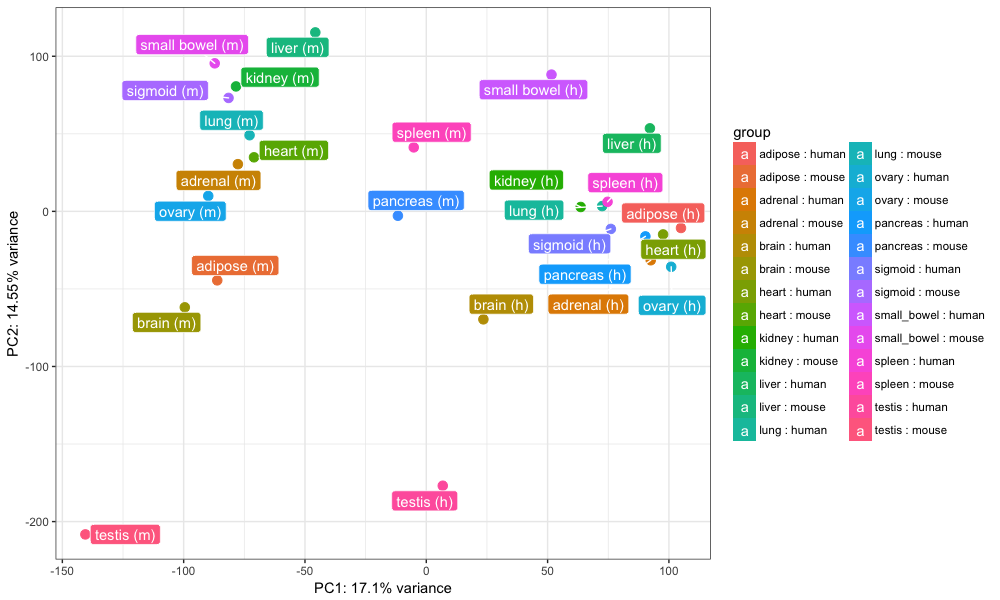
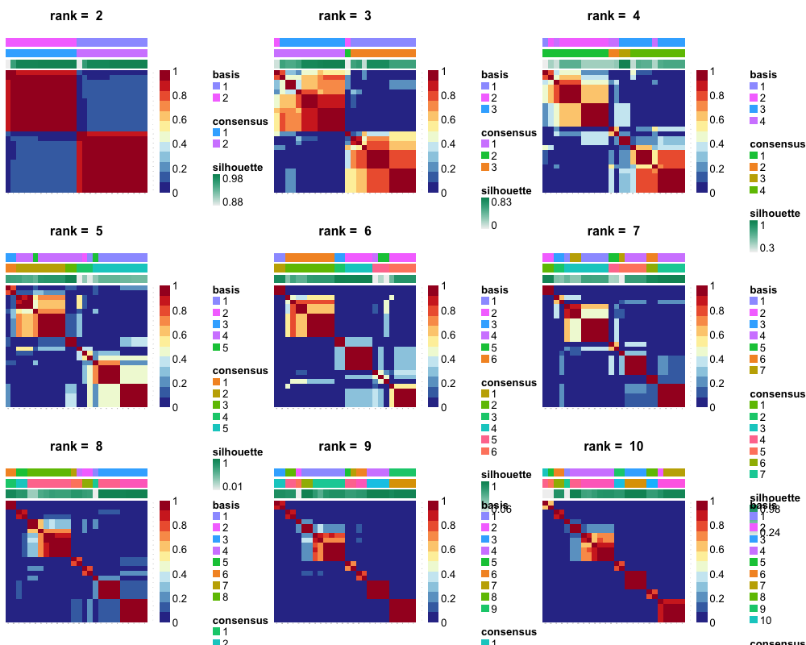
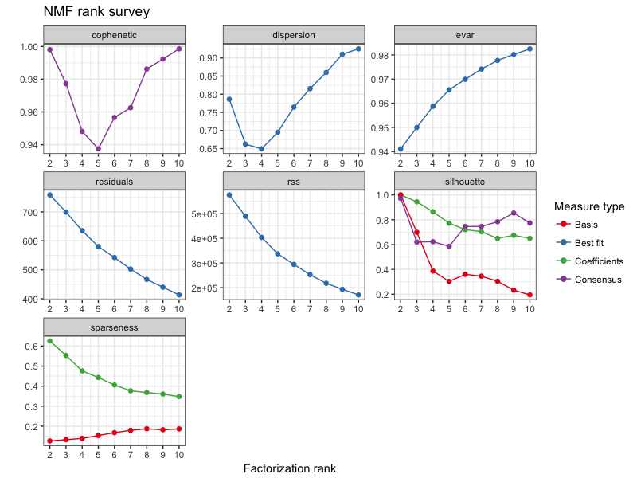
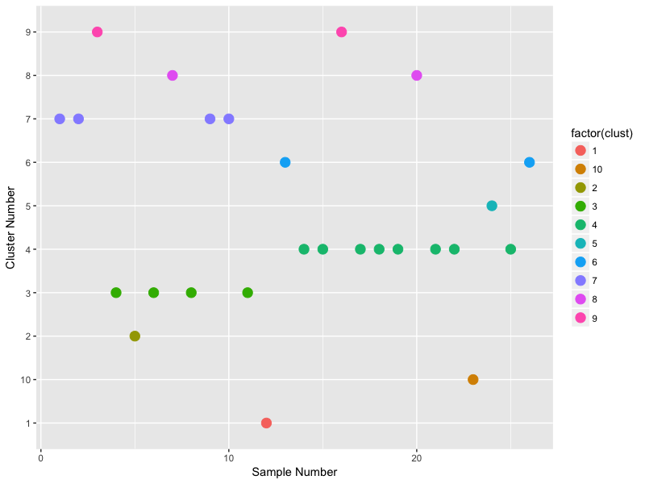

<br>
**Package**: `r Rpackage("DASC")`<br />
**Authors**: `r packageDescription("DASC")[["Author"]]` <br />
**Version**: `r packageDescription("DASC")[["Version"]]`<br />
**Compiled date**: `r Sys.Date()`<br />
**License**: `r packageDescription("DASC")[["License"]]`<br />
**Prerequisites**: NMF, cvxclustr, Biobase <br />

```{r style, echo = FALSE, results = 'asis'}
BiocStyle::markdown()
```

```{r setup, echo=FALSE, message=FALSE}
library(knitr)
opts_chunk$set(comment=NA, fig.align="center", warning=FALSE)

## Libraries
library(NMF)
library(cvxclustr)
library(DESeq2)
library(ggplot2)
library(pcaExplorer)
```

# Getting started

`r Biocpkg("DASC")` is an R package distributed as part of the [Bioconductor](http://bioconductor.org) project. To install the package, start R and enter:

```{r installation, eval=FALSE}
source("http://bioconductor.org/biocLite.R")
biocLite("DASC")
```

Also, make sure to that `r CRANpkg("NMF")`, `r CRANpkg("cvxclustr")` and `r Biocpkg("Biobase")` are installed in your system before running `r Biocpkg("DASC")`. 

Once `r Rpackage("DASC")` is installed, it can be loaded to the R enviornment by the following command.

```{r loadlibrary, eval=FALSE}
library(DASC)
```

# Introduction

`r Biocpkg("DASC")` is used for identifying batches in a and classifying samples into different batches in a high dimensional gene   expression dataset. The batch information can be further used as a covariate in conjunction with other variables of interest among standard bioinformatics analysis like differential expression analysis.

## Citation info

If you use `r Biocpkg("DASC")` for your analysis, please cite it as here below:

To cite package ‘DASC’ in publications use:

```
@Manual{,
    title = {DASC: Detecting hidden batch factors through data adaptive adjustment for biological effects.},
    author = {Haidong Yi, Ayush T. Raman, Han Zhang, Genevera I. Allen and Zhandong Liu},
    year = {2017},
    note = {R package version 0.1.0},
}
```

# Setting up the data
The first step in using cvxbatch package is to properly format the data. For example, in case of gene expression data, it should be a matrix with features (genes, transcripts, voxels) in the rows and samples in the columns. cvxbatch then requires the information for the variable of interest to model the gene expression data effectively. For example, variable of interest could be a genotype or treatment information. Below is an example of Stanford dataset (Chen et. al. PNAS, 2015; Gilad et. al. F1000 Research, 2015).

```{r, message=FALSE, eval=FALSE}

## filtered raw counts data from Gilad et al. F1000 Research
## i.e filtering out lower 30% + mitochondrial genes
set.seed(99)
data("rawCounts")
data("datasets")

## Using a smaller dataset
idx <- which(datasets$tissue %in% c("adipose", "adrenal", "pancreas", "brain", "spleen", "small_bowel"))
rawCounts <- rawCounts[,idx]
datasets <- datasets[idx,]

## raw counts
head(rawCounts)
dim(rawCounts)

## metadata
head(datasets)
dim(datasets)
```

# Batch detection using PCA Analysis

```{r, message = FALSE, eval = FALSE}

## Normalizing the dataset using DESeq2
dds <- DESeqDataSetFromMatrix(rawCounts, datasets, design = ~ species + tissue)
dds <- estimateSizeFactors(dds)
dat <- counts(dds, normalized = TRUE)
rld.dds <- rlog(dds) ## this step will take some time
lognormalizedCounts <- log2(dat + 1)

## PCA plot using 
pcaplot(rld.dds, intgroup = c("tissue", "species"), ntop = 1000, pcX = 1, pcY = 2)

```

<p align="center">

</p>

The PCA plot PC1 shows the differences between the tissues and PC2 shows the differences between the species i.e. samples clustering based on species.

# Batch detection using DASC

```{r, message = FALSE, eval = FALSE}
res <- convexBatch(edata = dat, pdata = datasets, factor = datasets$tissue,  
                      method='ama', type = 3, lambda = 1, rank = 2:10, nrun = 50, 
                        annotation='Stanford Dataset')
## Consensus plot
consensusmap(res)

```

<p align="center">

</p>

```{r, message=FALSE, eval = FALSE}

## Residual plot
plot(res)

``` 

<p align="center">

</p>

```{r, message = FALSE, eval = FALSE}

## Batches -- dataset has 6 batches
sample.clust <- data.frame(sample.name = colnames(lognormalizedCounts), 
                            clust = as.vector(predict(res$fit$`6`)), 
                              batch = datasets$seqBatch)
ggplot(data = sample.clust, aes(x = c(1:12), y = clust, color = factor(clust))) +  
          geom_point(size = 4) + xlab("Sample Number") + ylab("Cluster Number")

```
<p align="center">

</p>

Based on the above plots, we observe that the dataset has 6 batches. This can further be compared with the sequencing platform or `datasets$seqBatch`, which suggest that difference in platform led to batch effects. Batch number can be used as another covariate, when differential expression analyses are performed.

# More Examples
We are currently working on vignette and will be uploading more examples soon.

# Session Info
```{r, message=FALSE}

sessionInfo()

```
